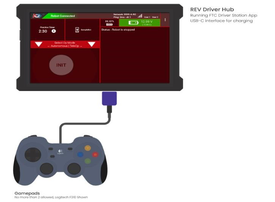
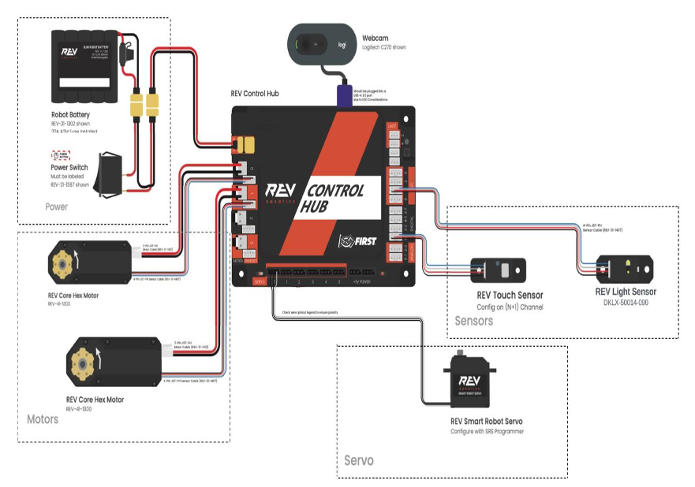
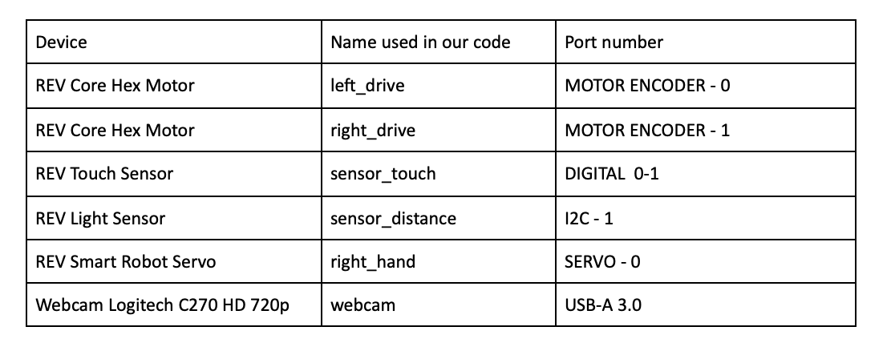

# 2023-2024 CENTERSTAGE Gameplay Shorter Version.
## Robot(*chitti*):

## Requirements
To use this Android Studio project, you will need Android Studio 2021.2 (codename Chipmunk) or later.

To program your robot in Blocks or OnBot Java, you do not need Android Studio.
## Getting Started
Review the [FTC Blocks Tutorial](https://ftc-docs.firstinspires.org/programming_resources/blocks/Blocks-Tutorial.html) to familiarize yourself with how to use the control system and then migrate to the [OnBot Java Tool](https://ftc-docs.firstinspires.org/programming_resources/onbot_java/OnBot-Java-Tutorial.html) or [Android Studio](https://ftc-docs.firstinspires.org/programming_resources/android_studio_java/Android-Studio-Tutorial.html) afterward.
## Downloading the Project
If you are an Android Studio programmer, there are several ways to download this repo. Note that if you use the Blocks or OnBot Java Tool to program your robot, then you do not need to download this repository.

-   If you are a git user, you can clone the most current version of the repository:

>`git clone https://github.com/Harshachennoor/Grad_Seminar_Project.git`

-   You can also download the project folder (as a .zip or .tar.gz archive file) from the Code subsection for this repository.

Once you have downloaded and uncompressed (if needed) your folder, you can use Android Studio to import the folder ("Import project (Eclipse ADT, Gradle, etc.)").
## Repository  Description
- Go to the **FtcRobotController** directory to view an external code sample about various sensors.
- **TeamCode** directory contains the code our team implemented.
    -  Go to **src/main** > **java/org/firstinspires/ftc/teamcode**
    - ***Autonomous_Mode*** directory contains two files
        - **[Autonomous_GO.java](https://github.com/Harshachennoor/Grad_Seminar_Project/blob/main/FtcRobotController-9.0/TeamCode/src/main/java/org/firstinspires/ftc/teamcode/Autonomous_Mode/Autonomous_GO.java "Autonomous_GO.java")** contains the code implemented during autonomous phase.
        - **[PipelineForAprilTagDetection.java](https://github.com/Harshachennoor/Grad_Seminar_Project/blob/main/FtcRobotController-9.0/TeamCode/src/main/java/org/firstinspires/ftc/teamcode/Autonomous_Mode/PipelineForAprilTagDetection.java "PipelineForAprilTagDetection.java")** is a supporting file used to setup pipeline for AprilTag Dectection.
    - ***Driver_Mode*** contains **[Driver_GO.java](https://github.com/Harshachennoor/Grad_Seminar_Project/blob/main/FtcRobotController-9.0/TeamCode/src/main/java/org/firstinspires/ftc/teamcode/Driver_Mode/Driver_GO.java "Driver_GO.java")** file is implemented during Driver-Controller period.
    - ***Testing*** directory contains two files used to test encoder and servo before the game starts.
    - **[chittiTheRobot.java](https://github.com/Harshachennoor/Grad_Seminar_Project/blob/main/FtcRobotController-9.0/TeamCode/src/main/java/org/firstinspires/ftc/teamcode/chittiTheRobot.java "chittiTheRobot.java")** contains the robot configurations and functions.

## Project Documentation
### Driver Station Overview:

### Robot Controller Overview

### Configuration Details:

